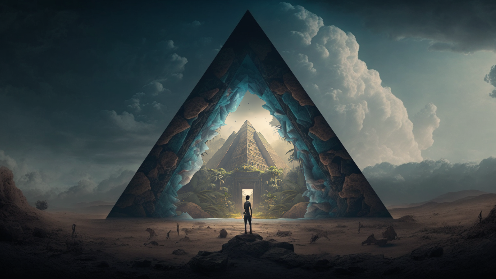

<h1 align="center">Noesia 📚</h1>

--- 

  
  &nbsp;&nbsp;&nbsp;
  
  &nbsp;&nbsp;&nbsp;
  

---

Welcome to our [THP](https://www.thehackingproject.org) final project: [Noesia 📚](https://noesia.vercel.app).

About 6 months ago, the three of us discovered the code for the first time.
After 24 weeks of intense training, we released our first React on Rails project!

### 🌐 - How to access

  &nbsp;&nbsp;&nbsp;&nbsp;&nbsp;&nbsp; ↳ [Noesia 📚](https://noesia.vercel.app) 

### 📌 - Context

What would you do if you had more free time? In 2017, the top answer in surveys was that the French would like to educate themselves and develop their general knowledge in their free time. If we look at the under 25s, 61% have already felt ashamed of a lack of general knowledge in the workplace in 2023.

In the "Noesia" team we believe that learning is about repetition, emotion and play. In this context we want to develop a hybrid application (PWA) that allows users to cultivate their knowledge through interactive mini-games developed by the "Noesia" team.

All ideas are good to take, we will be delighted to read your feedback, do not hesitate to contact us. 📬

- For this, we have developed a [React application](https://github.com/Ericcost/Noesia/tree/main/noesia_app)
 

  
  &nbsp;&nbsp;&nbsp;
  
  &nbsp;&nbsp;&nbsp;
  

- Linked to a [Rails API](https://github.com/Ericcost/Noesia/tree/main/noesia_api)
 

  
  &nbsp;&nbsp;&nbsp;
  

### ✅ - Features

[x] - Access to a first enigma without registration
[x] - Registration / Login
[x] - Two enigmas (and many more to come!)
[x] - A system of levels, experience and characteristics that will serve you later in your adventure.
[x] - Full screen mode for total immersion
[x] - Achievements ! (and some hidden!)

🔜

[] - A more complete story
[] - More enigmas
[] - More achievemnts
[] - ... ?

### 👨‍💻 - Authors Details 

- [@KevinTAZARO](https://github.com/KevinTAZARO)
- [@Ericcost](https://github.com/Ericcost)
- [@BenjaminCharmes](https://github.com/BenjaminCharmes)
